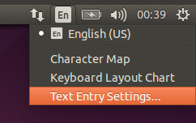
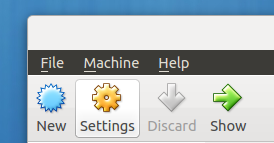
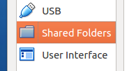
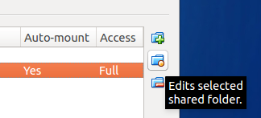
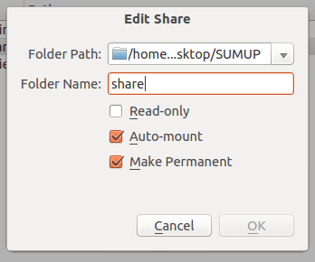

Setup:
======

Open VirtualBox and create a new virtual machine using "Ubuntu, 64bit" as the OS. When prompted to create a virtual hard disk select the existing one provided by SumUp.
The password for this virtual machine is `sumup`

Start the virtual machine. If you are unable to enter certain characters you may need to change the keyboard layout in the top right corner:

Sharing a folder for analysis
-----------------------------

In order to analyze documents you need to share the folder containing the files with the virtual machine.
This should be done with the virtual machine turned off, otherwise the settings will not be permanent. Open the VM Settings and go to Shared Folders.

Click on the button to add a shared folder.

 
Choose the folder containing the files you want to work on. Name the shared folder "share", and activate automount.

Once you start the virtual machine your files will be available in the `/media/sf_share` folder.

If that doesn't work see the _automount issues_ section

Usage:
======

Data conversion:
================

Open a terminal using `ctrl+alt+T`. Run the command `dir2json.py source` where `source` is the folder containing your files. The code will scan the folder and all subfolders to extract plaintext from files. It will create a folder named `output` that you can later import into anseri.

For example: `dir2json.py /media/sf_share`

Importing data into anseri:
===========================

To import your data run the command: `python ~/Desktop/run_anseri.py import -l english db output` 

Replace `db` with the name you want to give to the new database, and `output` with the path of the folder containing your data, generated with one of the conversion scripts. This will create an `anseri` folder containing the generated database (for example `~/output` or `~/Desktop/output`).

Generating topics:
==================

To generate topics, use a command like: `python ~/Desktop/run_anseri.py topics sent_db -nf 16 -nd 32 -nt 64 -s -k interesting words`

Options are as follows:

- `sent_db`: name of the database. Use `db` to classify entire documents, `sent_db` to do sentence-level classification (usually better)
- `-nt`: number of topics to generate
- `-nf`: number of features (words) per topic
- `-nd`: number of documents per topic
- `-s` : print output to a file in the `anseri` subfolder
- `-k` : limit analysis to documents containing the following keyword(s)
- `-h` : for help

Common issues:
==============

Automount issues
----------------

If the shared folder doesn't mount automatically open a terminal (`Ctrl+alt+T`) and run:

`mkdir ~/Desktop/share`

`sudo mount -t vboxsf -o rw,uid=1000,gid=1000 share ~/Desktop/share`

This should mount your folder in `~/Desktop/share/`. (Replace `~/Desktop/share/` with another folder if needed)

Shared folder permissions
-------------------------

If you can't access the shared folder you probably need to add your user to the vboxsf group:

`sudo adduser <user> vboxsf`

"Cannot register the hard disk"
-------------------------------

This happens when a virtual machine is already using a .vdi image with the same UUID. To change the image UUID run:

`VBoxManage internalcommands sethduuid disk.vdi`

Where disk.vdi is the name of the vdi you want to use.

For any other issue, contact alessandro.preziosi@sumupanalytics.com
